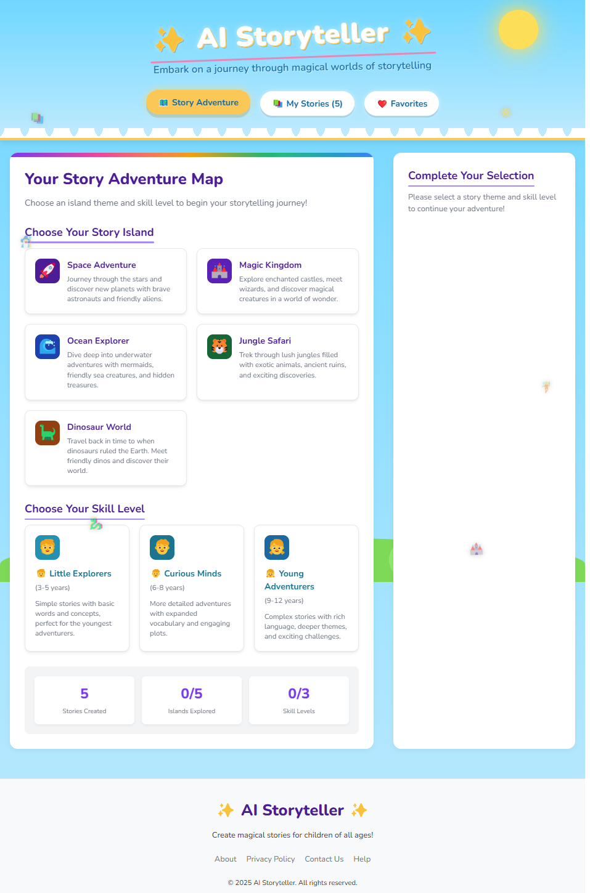
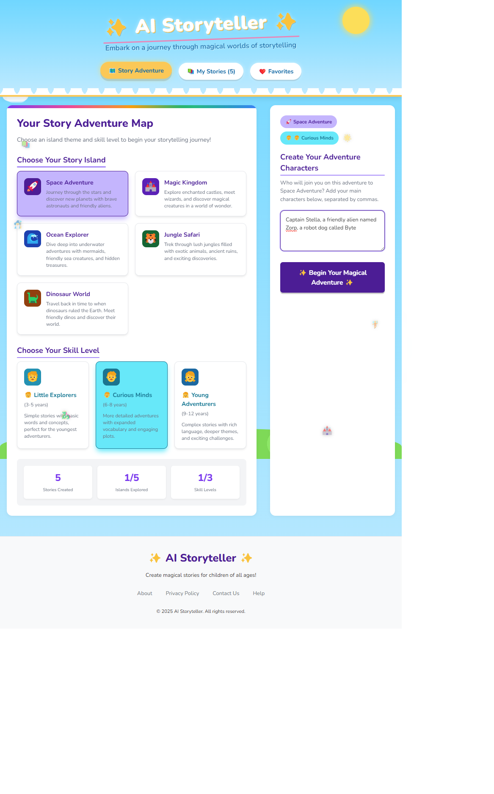
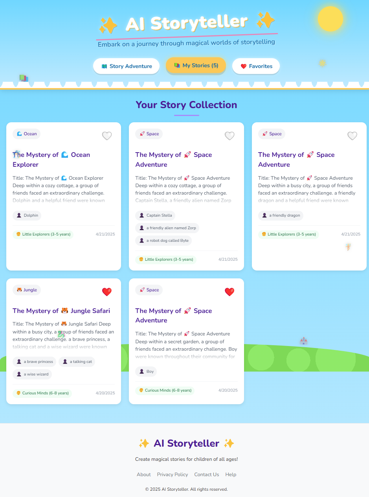
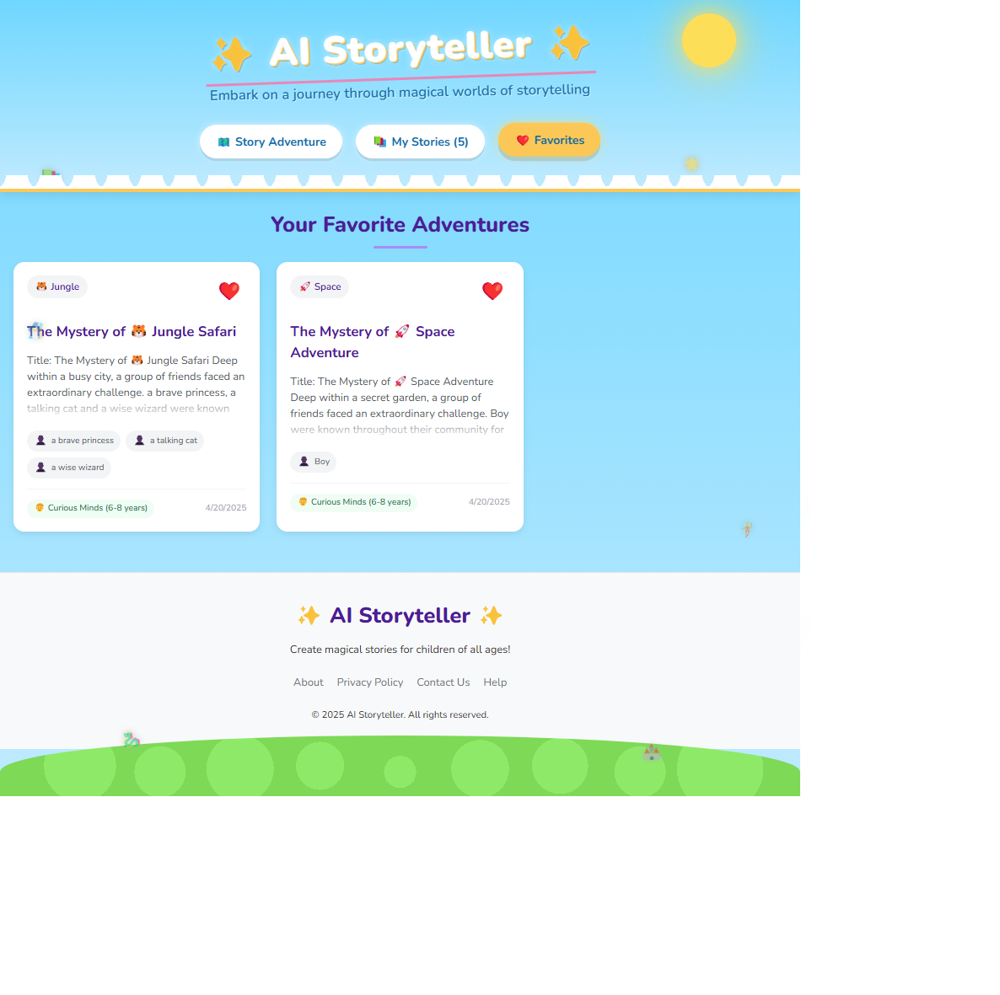
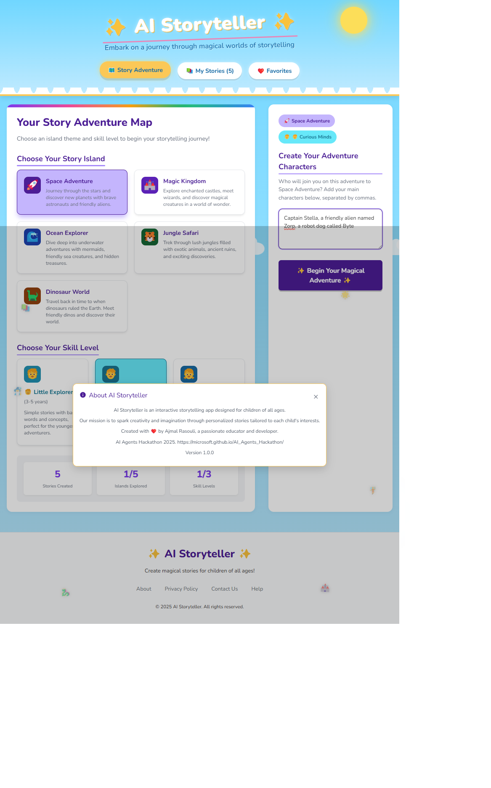

# AI Storyteller

An interactive AI-powered storytelling application that generates personalized children's stories based on themes, characters, and age groups.

## Screenshots

|  |  |
|:---:|:---:|
| *Adventure Map* | *Story Creation* |

|  |  |
|:---:|:---:|
| *My Stories* | *Favorites* |

|  |
|:---:|
| *About* |

## Features

- 🤖 AI-powered story generation using Azure OpenAI
- 📚 Multiple age group support (3-5, 6-8, 9-12 years)
- 🎨 Various story themes (Space Adventure, Magic Kingdom, Ocean Explorer, etc.)
- ⭐ Story favoriting system
- 🔊 Text-to-speech narration with natural-sounding voices
- 📧 Email stories directly from the application
- 🖨️ Print-friendly story formatting
- 🎯 Educational focus with learning objectives
- ✨ Enhanced animated UI with visual feedback:
  - 📝 Typewriter effect for story reveal
  - 📖 Book flipping animation during story generation
  - 💫 Magical sparkle effects and dynamic elements
  - 🔄 Rotating loading messages during story creation
  - ✨ Confetti celebration when stories are generated
  - 📱 Responsive design with smooth transitions

## Tech Stack

- Frontend: React + TypeScript
- Backend: Flask + SQLAlchemy
- AI: Azure OpenAI (GPT-4 Mini)
- Text-to-Speech: Web Speech API with premium voice selection
- Database: SQLite
- Styling: CSS with inline styles for consistent rendering

## Setup

1. Clone the repository:
   ```bash
   git clone https://github.com/ajmalrasouli/ai-storyteller.git
   cd ai-storyteller
   ```

2. Install dependencies:
   ```bash
   npm install
   pip install -r requirements.txt
   ```

3. Create a `.env` file in the root directory with your Azure OpenAI credentials:
   ```
   DATABASE_URL=sqlite:///stories.db
   AZURE_OPENAI_API_KEY=your_azure_openai_api_key
   AZURE_OPENAI_ENDPOINT=your_azure_openai_endpoint
   FLASK_APP=app.py
   FLASK_ENV=development
   ```

4. Start the development servers:
   ```bash
   # Start the Flask backend
   python app.py
   
   # In a separate terminal, start the frontend
   npm run dev:frontend
   ```

## Using the Application

1. **Create a Story**:
   - Select a theme (Space Adventure, Magic Kingdom, etc.)
   - Add characters (comma-separated)
   - Choose an age group
   - Click "Begin Your Magical Adventure" to generate

2. **View Stories**:
   - Browse all stories in the "My Stories" tab
   - View favorite stories in the "Favorites" tab
   - Click on a story card to view the full content with animated text reveal

3. **Story Actions**:
   - Add/remove stories from favorites
   - Listen to stories with natural text-to-speech narration
   - Email stories to share them with others
   - Print stories in a nicely formatted layout

## Animation Features

The application includes several animation features to enhance the user experience:

- **Story Generation**: Animated book with flipping pages and writing lines during story creation
- **Text Reveal**: Typewriter effect for story titles and fade-in animations for paragraphs
- **Loading Messages**: Dynamic, changing messages during story generation to keep users engaged
- **Visual Feedback**: Sparkle effects, confetti celebration, and floating decorative elements

## Text-to-Speech Features

The application offers an immersive narration experience:

- **Premium Voice Selection**: Automatically selects the highest quality voice available
- **Natural Rhythm**: Adds appropriate pauses between sentences and paragraphs
- **Enhanced Storytelling**: Optimized speech parameters for clarity and engagement
- **Age-Appropriate**: Narration speed and tone suitable for children's stories
- **Interactive Control**: Simple toggle between play and pause functionality

## Environment Variables

- `DATABASE_URL`: SQLite database URL
- `AZURE_OPENAI_API_KEY`: Your Azure OpenAI API key
- `AZURE_OPENAI_ENDPOINT`: Your Azure OpenAI endpoint URL
- `FLASK_APP`: Flask application entry point
- `FLASK_ENV`: Flask environment (development/production)

## Development

- `npm run dev:frontend`: Start frontend development server
- `python app.py`: Start backend server
- `npm run build`: Build frontend for production

## License

MIT
