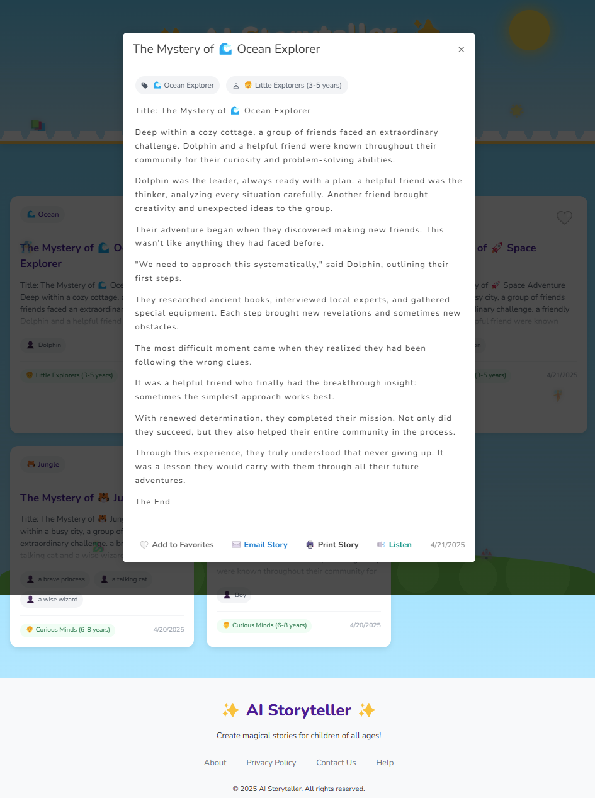
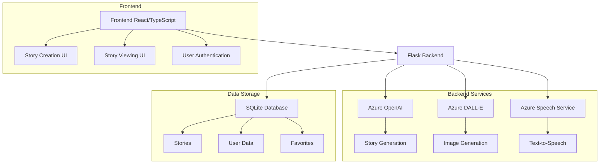
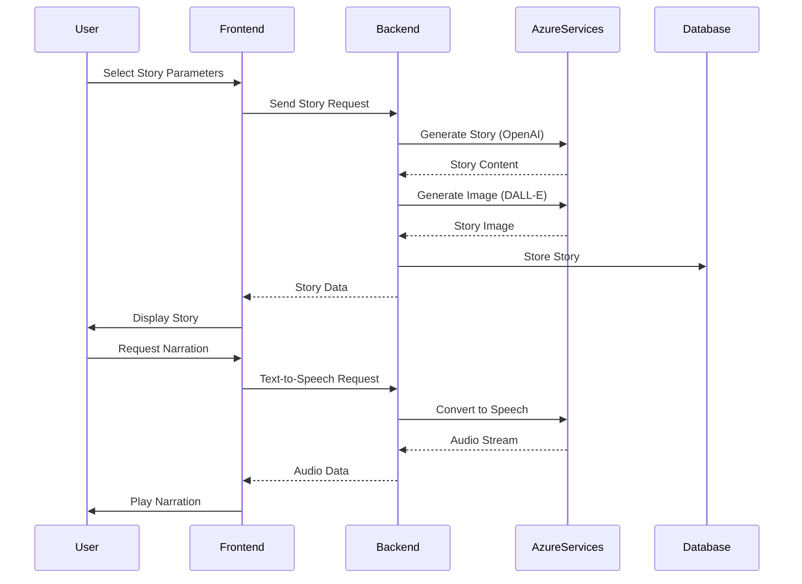
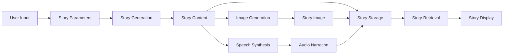

# AI Storyteller

An interactive AI-powered storytelling application that generates personalized children's stories based on themes, characters, and age groups.

## Video Demo

[](https://youtu.be/M3X0Q5n2AjA)

*Click the image above to watch the demo video*

## Screenshots

|  |  |
|:---:|:---:|
| *Adventure Map* | *Story Creation* |

|  |  |
|:---:|:---:|
| *My Stories* | *Favorites* |

|  |  |
|:---:|:---:|
| *Story Page with Read Aloud* | *About* |

## Features

- 🤖 AI-powered story generation using Azure OpenAI
- 🎨 AI-generated illustrations using Azure DALL-E
  - Child-friendly, whimsical digital art style
  - Theme and character-specific illustrations
  - Age-appropriate visual content
  - Automatic regeneration option
  - Fallback to curated theme-based images
- 🗣️ High-quality text-to-speech using Azure Speech Service
  - Natural-sounding voices with multiple language support
  - Custom voice styles for different story characters
  - Dynamic speech rate adjustment based on age group
  - Background music integration for immersive storytelling
  - Voice selection for different story themes
- 📚 Multiple age group support (3-5, 6-8, 9-12 years)
- 🎨 Various story themes (Space Adventure, Magic Kingdom, Ocean Explorer, etc.)
- ⭐ Story favoriting system
- 🔊 Text-to-speech narration with natural-sounding voices
- 📧 Email stories with smart content truncation
  - Automatic length management for email clients
  - Includes story metadata and illustration links
  - Fallback to print option for long stories
- 📱 Social sharing integration
  - Direct sharing to Twitter, Facebook, and WhatsApp
  - Native Web Share API support
  - Clipboard fallback for unsupported browsers
  - Custom sharing messages with story metadata
- 🖨️ Print-friendly story formatting
- 🎯 Educational focus with learning objectives
- ✨ Enhanced animated UI with visual feedback:
  - 📝 Typewriter effect for story reveal
  - 📖 Book flipping animation during story generation
  - 💫 Magical sparkle effects and dynamic elements
  - 🔄 Rotating loading messages during story creation
  - ✨ Confetti celebration when stories are generated
  - 📱 Responsive design with smooth transitions

## Tech Stack

- Frontend: React + TypeScript
- Backend: Flask + SQLAlchemy
- AI: Azure OpenAI (GPT-4 Mini)
- Image Generation: Azure DALL-E
- Text-to-Speech: Azure Speech Service with premium voice selection
- Database: SQLite
- Styling: CSS with inline styles for consistent rendering

## Setup

1. Clone the repository:
   ```bash
   git clone https://github.com/ajmalrasouli/ai-storyteller.git
   cd ai-storyteller
   ```

2. Install Python dependencies:
   ```bash
   pip install -r requirements.txt
   ```

3. Install Node.js dependencies:
   ```bash
   npm install
   ```

4. Create a `.env` file in the root directory with your Azure credentials:
   ```
   DATABASE_URL=sqlite:///instance/stories.db
   AZURE_OPENAI_API_KEY=your_azure_openai_api_key
   AZURE_OPENAI_ENDPOINT=your_azure_openai_endpoint
   AZURE_DALLE_API_KEY=your_azure_dalle_api_key
   AZURE_DALLE_ENDPOINT=your_azure_dalle_endpoint
   AZURE_DALLE_API_VERSION=2024-02-01
   AZURE_SPEECH_KEY=your_azure_speech_key
   AZURE_SPEECH_REGION=your_azure_speech_region
   FLASK_APP=app.py
   FLASK_ENV=development
   ```

5. Initialize the database:
   ```bash
   python migrate_db.py
   ```

6. Start the development servers:
   ```bash
   # Start the Flask backend
   python app.py
   
   # In a separate terminal, start the frontend
   npm run dev
   ```

## Project Structure

```
ai-storyteller/
├── src/                    # Frontend React/TypeScript source
│   ├── App.tsx            # Main application component
│   ├── App.css            # Main styles
│   ├── lib/               # Utility functions and components
│   └── main.tsx           # Application entry point
├── public/                # Static assets
│   └── images/           # Story illustrations and UI assets
├── instance/             # Database and instance files
├── app.py               # Flask backend application
├── requirements.txt     # Python dependencies
├── package.json        # Node.js dependencies
└── vite.config.ts      # Vite configuration
```

## System Architecture



## Component Flow



## Data Flow



## Development

- `npm run dev`: Start frontend development server
- `python app.py`: Start backend server
- `npm run build`: Build frontend for production
- `python migrate_db.py`: Initialize or update database schema

## Testing

The project includes several test scripts:
- `test_azure_apis.py`: Tests Azure API integrations
- `validate_azure_services.py`: Validates Azure service configurations
- `check_openai_key.py`: Verifies OpenAI API key
- `Azurekeycheck.py`: Validates Azure service keys

## Using the Application

1. **Create a Story**:
   - Select a theme (Space Adventure, Magic Kingdom, etc.)
   - Add characters (comma-separated)
   - Choose an age group
   - Click "Begin Your Magical Adventure" to generate
   - An AI-generated illustration will be created automatically

2. **View Stories**:
   - Browse all stories in the "My Stories" tab
   - View favorite stories in the "Favorites" tab
   - Click on a story card to view the full content with animated text reveal
   - Each story includes a unique AI-generated illustration

3. **Story Actions**:
   - Add/remove stories from favorites
   - Listen to stories with natural text-to-speech narration
   - Email stories with smart content management
   - Share stories directly to social media platforms
   - Print stories in a nicely formatted layout
   - Regenerate illustrations if desired

4. **Sharing Options**:
   - Email: Automatically formats stories for email clients
   - Social Media: Share directly to Twitter, Facebook, or WhatsApp
   - Web Share: Use native sharing on supported devices
   - Print: Generate a print-friendly version
   - Copy Link: Quick access to story URLs

## Animation Features

The application includes several animation features to enhance the user experience:

- **Story Generation**: Animated book with flipping pages and writing lines during story creation
- **Text Reveal**: Typewriter effect for story titles and fade-in animations for paragraphs
- **Loading Messages**: Dynamic, changing messages during story generation to keep users engaged
- **Visual Feedback**: Sparkle effects, confetti celebration, and floating decorative elements

## Text-to-Speech Features

The application offers an immersive narration experience using Azure Speech Service:

- **Premium Voice Selection**: Multiple high-quality voices with different accents and styles
- **Character Voices**: Unique voice styles for different story characters
- **Dynamic Narration**: Adjustable speech rate and pitch based on story content
- **Background Music**: Optional background music for enhanced storytelling
- **Multi-language Support**: Stories can be narrated in multiple languages
- **Interactive Control**: Advanced playback controls with pause, resume, and speed adjustment
- **Voice Customization**: Ability to select different voices for different story themes
- **Age-Appropriate Narration**: Optimized speech parameters for different age groups

## Environment Variables

- `DATABASE_URL`: SQLite database URL
- `AZURE_OPENAI_API_KEY`: Your Azure OpenAI API key
- `AZURE_OPENAI_ENDPOINT`: Your Azure OpenAI endpoint URL
- `AZURE_DALLE_API_KEY`: Your Azure DALL-E API key
- `AZURE_DALLE_ENDPOINT`: Your Azure DALL-E endpoint URL (base URL only)
- `AZURE_DALLE_API_VERSION`: Azure DALL-E API version
- `AZURE_SPEECH_KEY`: Your Azure Speech Service API key
- `AZURE_SPEECH_REGION`: Your Azure Speech Service region
- `FLASK_APP`: Flask application entry point
- `FLASK_ENV`: Flask environment (development/production)

## License

MIT
