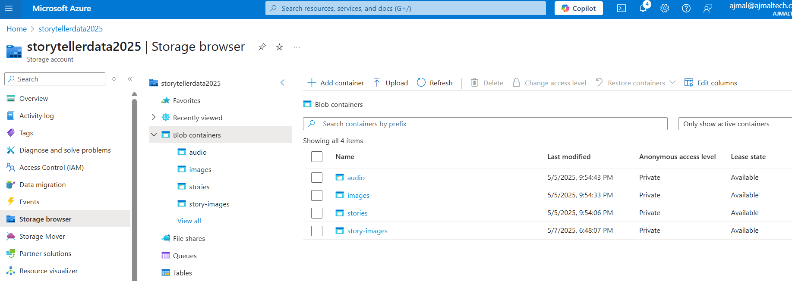
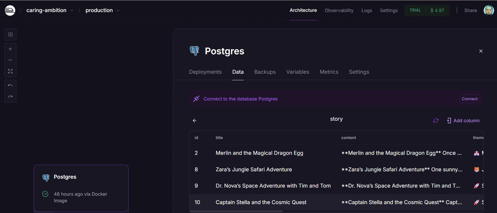
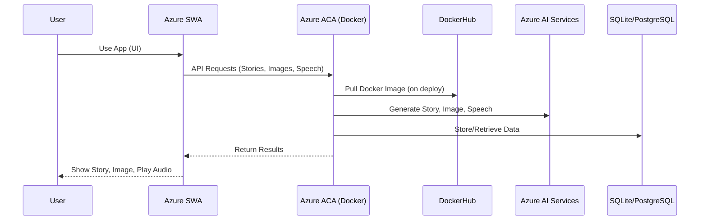
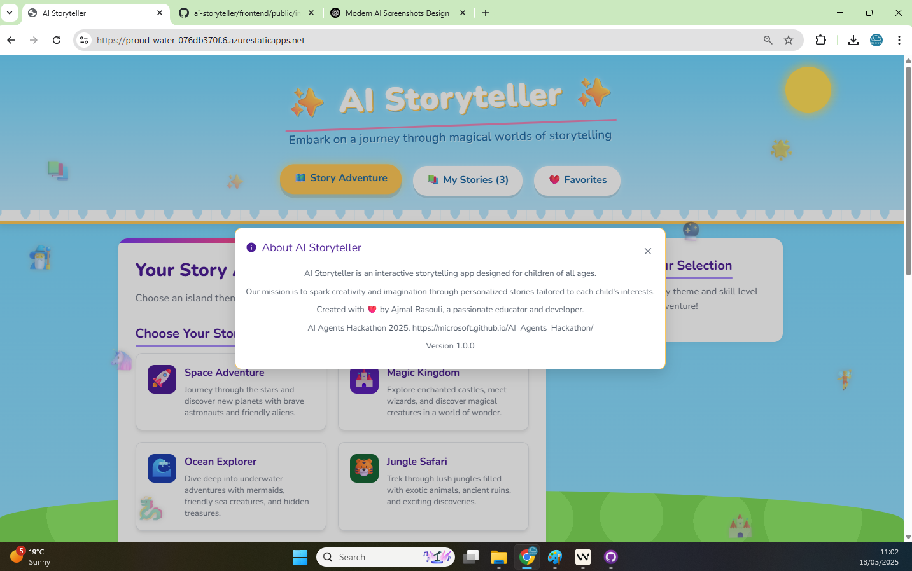

# ✨ AI Storyteller ✨

> **AI Storyteller for Children**
>
> 🧒📚 _An innovative AI-powered application that creates personalized bedtime stories for children based on their interests, favorite characters, and educational themes._
>
> By leveraging advanced natural language processing (NLP) and generative models, the AI crafts engaging, interactive stories that teach valuable lessons such as kindness, patience, and sharing. The app adapts to each child's preferences, ensuring a unique and enjoyable experience every time. With features like character customization and moral story adaptation, AI Storyteller fosters imagination, learning, and positive values in an interactive way.

<div align="center">

[](https://youtu.be/HLox3JVXD2I)

[](https://proud-water-076db370f.6.azurestaticapps.net/)
[](https://youtu.be/HLox3JVXD2I)

[](https://azure.microsoft.com/en-us/services/app-service/static/)
[](https://azure.microsoft.com/en-us/products/container-apps/)
[](https://hub.docker.com/)
[](https://azure.microsoft.com/en-us/products/cognitive-services/openai-service/)
[](https://azure.microsoft.com/en-us/products/cognitive-services/dall-e/)
[](https://azure.microsoft.com/en-us/products/cognitive-services/speech-services/)
[](https://railway.app)
[](https://azure.microsoft.com/en-us/products/storage/blobs/)


</div>

## 📋 Table of Contents
- [About](#about)
- [Feature Highlights](#-feature-highlights)
- [Architecture Overview](#-colorful-architecture-overview)
- [Storage Infrastructure](#-storage-infrastructure)
- [Two-Server Cloud Architecture](#two-server-cloud-architecture)
- [Demo](#-demo)
- [Hackathons Challenge](#-hackathons-challenge-)
- [Screenshots](#-screenshots)
- [Features](#features)
- [Tech Stack](#tech-stack)
- [Deployment](#deployment)
- [Setup](#setup)
- [Project Structure](#project-structure)
- [System Architecture](#system-architecture)
- [Component Flow](#component-flow)
- [Development](#development)
- [Testing](#testing)
- [Using the Application](#using-the-application)
- [Environment Variables](#environment-variables)
- [License](#-license)

---

## About

**AI Storyteller** is an interactive, AI-powered storytelling platform for children, featuring:

- Personalized story generation (Azure OpenAI)
- AI-generated illustrations (Azure DALL-E)
- Lifelike narration (Azure Speech Service)
- A beautiful, modern user experience

### View Live App
https://proud-water-076db370f.6.azurestaticapps.net/

---

## 🎥 Demo

[](https://youtu.be/HLox3JVXD2I)

👉 [Watch the Demo on YouTube](https://youtu.be/HLox3JVXD2I)

## 🏆 Hackathons Challenge 🏆

- **Modern Azure-native architecture**: Scalable, secure, and cost-effective.
- **Separation of concerns**: Frontend and backend are independently deployable and scalable.
- **DevOps best practices**: CI/CD, Dockerized backend, cloud-native deployment.
- **Engaging, accessible, and educational for kids.**

## 🎨 Colorful Architecture Overview

```mermaid
flowchart LR
    subgraph Azure Static Web Apps
        style FE fill:#e0f7fa,stroke:#0078D4,stroke-width:2px
        FE["<b>Frontend<br/>(React + TypeScript)</b><br/>🌐"]
    end
    subgraph Azure Container Apps
        style BE fill:#e8f5e9,stroke:#008272,stroke-width:2px
        BE["<b>Backend<br/>(Flask API)</b><br/>🔗"]
    end
    subgraph Docker Hub
        style DH fill:#e3f2fd,stroke:#2496ED,stroke-width:2px
        DH[("<b>Docker Image</b><br/>🐳")]
    end
    subgraph Azure Storage
        style AS fill:#f3e5f5,stroke:#512da8,stroke-width:2px
        AS["<b>Azure Blob Storage</b><br/>📦<br/>Images, Audio, Stories"]
    end
    subgraph Database
        style DB fill:#e8f5e9,stroke:#4CAF50,stroke-width:2px
        DB[("<b>PostgreSQL</b><br/>Hosted on Railway")]
    end
    FE -- "<b style='color:#0078D4;'>API Requests<br/>(VITE_API_URL)</b>" --> BE
    BE -- "<b style='color:#2496ED;'>Pulls Image</b>" --> DH
    BE -- "Storage" --> AS
    BE -- "AI/Media APIs" --> OA["<b>Azure OpenAI<br/>🎓</b>"]
    BE -- "Image Gen" --> DALLE["<b>Azure DALL-E<br/>🎨</b>"]
    BE -- "Speech" --> SPEECH["<b>Azure Speech<br/>🗣️</b>"]
    BE -- "DB" --> DB
```

<div align="center">



</div>

## 📦 Storage Infrastructure

<div align="center">

### Azure Blob Storage


- Stores all generated images from DALL-E
- Stores audio files from text-to-speech
- Stores story content and metadata
- Secure, scalable, and globally accessible

### Railway PostgreSQL Database


- Hosted PostgreSQL database on Railway
- Stores user data, stories, and favorites
- Secure and scalable database service
- Easy to manage and monitor

</div>

---

## Two-Server Cloud Architecture

| Layer     | Service                        | Description                                                                                   |
|-----------|-------------------------------|-----------------------------------------------------------------------------------------------|
| <span style="color:#0078D4">Frontend</span>  | **Azure Static Web Apps**      | React/TypeScript SPA, globally distributed, connects to backend via `VITE_API_URL`            |
| <span style="color:#008272">Backend</span>   | **Azure Container Apps (ACA)** | Flask REST API, scalable, pulls Docker image from Docker Hub                                  |
| <span style="color:#2496ED">Image</span>     | **Docker Hub**                 | Stores and delivers the backend container image                                               |
| <span style="color:#10a37f">AI/Media</span>  | **Azure OpenAI, DALL-E, Speech** | Power story generation, illustration, and narration                                           |
| <span style="color:#4CAF50">Database</span>  | **PostgreSQL (Railway)**      | Stores stories, users, favorites, hosted on Railway                                          |

---

## 🔗 How the Pieces Connect

- **Frontend** (Azure SWA) calls **Backend API** (ACA) using the `VITE_API_URL` environment variable.
- **Backend** (ACA) is deployed as a Docker container, image managed on **Docker Hub**.
- **Backend** calls Azure AI services for story content, images, and narration.
- **Backend** stores persistent data in PostgreSQL (hosted on Railway).
- **Backend** uses Azure Blob Storage for storing:
  - Generated images from DALL-E
  - Audio files from text-to-speech
  - Story content and metadata

---

## 🦄 Feature Highlights

<table>
  <tr>
    <td width="33%">
      <h3>🤖 AI Story Generation</h3>
      <ul>
        <li>Azure OpenAI GPT-4 creates magical, personalized stories</li>
        <li>Personalized characters & themes</li>
        <li>Educational value & moral lessons</li>
        <li>Age-appropriate content (3-5, 6-8, 9-12)</li>
      </ul>
    </td>
    <td width="33%">
      <h3>🎨 AI Illustrations</h3>
      <ul>
        <li>Azure DALL-E 3 generates whimsical, child-friendly images</li>
        <li>Character-specific illustrations</li>
        <li>Theme-based visual content</li>
        <li>Automatic regeneration option</li>
      </ul>
    </td>
    <td width="33%">
      <h3>🗣️ Text-to-Speech</h3>
      <ul>
        <li>Azure Speech Service narrates with lifelike voices</li>
        <li>Custom voice styles for characters</li>
        <li>Dynamic speech rate by age group</li>
        <li>Background music integration</li>
      </ul>
    </td>
  </tr>
  <tr>
    <td width="33%">
      <h3>⭐ User Experience</h3>
      <ul>
        <li>Story favoriting system</li>
        <li>Email stories with smart content truncation</li>
        <li>Print-friendly story formatting</li>
        <li>Social sharing integration</li>
      </ul>
    </td>
    <td width="33%">
      <h3>✨ Enhanced UI</h3>
      <ul>
        <li>Typewriter effect for story reveal</li>
        <li>Book flipping animation during generation</li>
        <li>Magical sparkle effects & dynamic elements</li>
        <li>Confetti celebration on generation</li>
      </ul>
    </td>
    <td width="33%">
      <h3>☁️ Cloud-Native</h3>
      <ul>
        <li>Dockerized backend for portability</li>
        <li>Modern Azure deployment architecture</li>
        <li>CI/CD workflow automation</li>
        <li>Secure environment variables</li>
      </ul>
    </td>
  </tr>
</table>

---

## 🛠️ Tech Stack

<table>
  <tr>
    <th>Layer</th>
    <th>Stack / Service</th>
    <th>Icon</th>
  </tr>
  <tr>
    <td>Frontend</td>
    <td>React, TypeScript, Vite, CSS</td>
    <td>🌐</td>
  </tr>
  <tr>
    <td>Backend</td>
    <td>Flask, SQLAlchemy, Python</td>
    <td>🐍</td>
  </tr>
  <tr>
    <td>Container</td>
    <td>Docker, Docker Hub</td>
    <td>🐳</td>
  </tr>
  <tr>
    <td>Cloud</td>
    <td>Azure SWA, Azure ACA</td>
    <td>☁️</td>
  </tr>
  <tr>
    <td>AI</td>
    <td>Azure OpenAI, DALL-E, Speech</td>
    <td>🤖🎨🗣️</td>
  </tr>
  <tr>
    <td>Database</td>
    <td>SQLite (Dev), PostgreSQL (Prod)</td>
    <td>🗄️</td>
  </tr>
  <tr>
    <td>DevOps</td>
    <td>GitHub Actions, Azure CLI</td>
    <td>🔁</td>
  </tr>
</table>

---

## 🧩 Component Sequence

<div align="center">



</div>

---

## 📸 Screenshots

<div align="center">

### 🌍 Adventure Experience

|  |  |
|:--:|:--:|
| **Adventure Map** | **Story Creation** |

### 📚 Your Library

|  |  |
|:--:|:--:|
| **My Stories** | **Favorites** |

### 📖 Story View

|  |  |
|:--:|:--:|
| **Story Page with Read Aloud** | **About** |

</div>

---

## Features

- 🤖 AI-powered story generation using Azure OpenAI (GPT-4)
- 🎨 AI-generated illustrations using Azure DALL-E 3
  - Child-friendly, whimsical digital art style
  - Theme and character-specific illustrations
  - Age-appropriate visual content
  - Automatic regeneration option
  - Fallback to curated theme-based images
- 🗣️ High-quality text-to-speech using Azure Speech Service
  - Natural-sounding voices with multiple language support
  - Custom voice styles for different story characters
  - Dynamic speech rate adjustment based on age group
  - Background music integration for immersive storytelling
  - Voice selection for different story themes
- 📚 Multiple age group support (3-5, 6-8, 9-12 years)
- 🎨 Various story themes (Space Adventure, Magic Kingdom, Ocean Explorer, etc.)
- ⭐ Story favoriting system
- 🔊 Text-to-speech narration with natural-sounding voices
- 📧 Email stories with smart content truncation
  - Automatic length management for email clients
  - Includes story metadata and illustration links
  - Fallback to print option for long stories
- 📱 Social sharing integration
  - Direct sharing to Twitter, Facebook, and WhatsApp
  - Native Web Share API support
  - Clipboard fallback for unsupported browsers
  - Custom sharing messages with story metadata
- 🖨️ Print-friendly story formatting
- 🎯 Educational focus with learning objectives
- ✨ Enhanced animated UI with visual feedback:
  - 📝 Typewriter effect for story reveal
  - 📖 Book flipping animation during story generation
  - 💫 Magical sparkle effects and dynamic elements
  - 🔄 Rotating loading messages during story creation
  - ✨ Confetti celebration when stories are generated
  - 📱 Responsive design with smooth transitions

---

## 🚀 Quickstart

### 1. **Clone & Install**
```bash
git clone https://github.com/ajmalrasouli/ai-storyteller.git
cd ai-storyteller
```

### 2. **Run Locally**
- **Backend**:
  ```bash
  cd backend
  pip install -r requirements.txt
  python app.py
  ```
- **Frontend**:
  ```bash
  cd frontend
  npm install
  npm run dev
  ```

### 3. **Build & Deploy**
- **Docker Image**:
  ```bash
  docker build -t storyteller-backend -f Dockerfile .
  docker tag storyteller-backend <dockerhub-username>/storyteller-backend:latest
  docker push <dockerhub-username>/storyteller-backend:latest
  ```
- **Deploy Backend to ACA**:
  ```bash
  az containerapp create --name storyteller-backend --resource-group storyteller-rg \
    --image <dockerhub-username>/storyteller-backend:latest \
    --environment storyteller-env --target-port 5000 --ingress 'external'
  ```
- **Deploy Frontend to SWA**:  
  Use Azure Portal or CLI, set `VITE_API_URL` to your backend API endpoint.

---

## Deployment

<details>
<summary><b>Frontend: Azure Static Web Apps (SWA)</b></summary>

The frontend is deployed on [Azure Static Web Apps](https://azure.microsoft.com/en-us/products/app-service/static) for a cost-effective, scalable, and Microsoft-native solution (ideal for hackathons). Deployment is automated via a GitHub Actions workflow, so every push to the `main` branch triggers a new build and deploy.

#### Step-by-Step: Deploying Frontend to Azure Static Web Apps

**Prerequisites:**
- Azure account with active subscription
- Azure CLI installed
- GitHub account with access to the repository

**1. Clone the repository:**
```bash
git clone https://github.com/ajmalrasouli/ai-storyteller.git
cd ai-storyteller/frontend
```

**2. Create `staticwebapp.config.json` (if not present):**
```json
{
  "routes": [
    { "route": "/*", "serve": "/index.html", "statusCode": 200 }
  ],
  "platform": { "apiRuntime": "node:18" }
}
```

**3. Login to Azure and create resources:**
```bash
az login
az group create --name swa-ai-storyteller --location eastus2
az staticwebapp create --name ai-storyteller-app --resource-group swa-ai-storyteller --location eastus2 --source https://github.com/ajmalrasouli/ai-storyteller --branch main --app-location "frontend" --output-location ".next" --login-with-github
```
*Note: Use an available region such as eastus2, centralus, westus2, westeurope, or eastasia.*

**4. Configure environment variables:**
- In the Azure Portal, go to your Static Web App > Configuration.
- Add all variables from your `.env.local` (e.g. API URLs, keys) using the appropriate prefix (e.g. `VITE_` for Vite apps).

**5. (Optional) Assign managed identity and enable custom domains:**
```bash
az staticwebapp identity assign --name ai-storyteller-app --resource-group swa-ai-storyteller
az staticwebapp hostname set --name ai-storyteller-app --hostname yourdomain.com
```

**6. Post-deployment:**
- Update all frontend API URLs to point to your Azure backend.
- Verify authentication and environment variable usage.
- Each push to GitHub triggers a new deployment via Actions workflow.

**Estimated Cost:** Free for hackathon-scale usage (100,000 requests/month on free tier).
</details>

<details>
<summary><b>Backend: Azure Container Apps (ACA)</b></summary>

You can deploy the backend to Azure Container Apps for maximum flexibility, or use Azure Functions for a fully serverless, cost-optimized solution (recommended for hackathons).

#### Deploying Backend to Azure Container Apps

1. Build and push Docker image to Docker Hub:
   ```bash
   # Build your Docker image locally:
   docker build -t storyteller-backend -f Dockerfile .
   
   # Tag your image for Docker Hub:
   docker tag storyteller-backend <dockerhub-username>/storyteller-backend:latest
   
   # Push the image to Docker Hub:
   docker push <dockerhub-username>/storyteller-backend:latest
   ```

2. Azure Setup:
   ```bash
   # Log in to Azure CLI:
   az login
   
   # Create a resource group (if needed):
   az group create --name storyteller-rg --location westeurope
   
   # Create a Container Apps environment:
   az containerapp env create --name storyteller-env --resource-group storyteller-rg --location westeurope
   ```

3. Deploy to ACA:
   ```bash
   # Deploy your container app (replace env vars as needed):
   az containerapp create \
     --name storyteller-backend \
     --resource-group storyteller-rg \
     --environment storyteller-env \
     --image <dockerhub-username>/storyteller-backend:latest \
     --target-port 5000 \
     --ingress 'external' \
     --env-vars KEY1=VALUE1 KEY2=VALUE2
   ```
   - Set your environment variables (API keys, DB URL, etc.) using `--env-vars` or via the Azure Portal.

4. After deployment, Azure will provide a public URL for your backend API.

#### Alternative: Azure Functions (More Cost-Effective)
For smaller projects or hackathons, you might consider Azure Functions:

1. Create Function App:
   ```bash
   az functionapp create --name ai-storyteller-api --resource-group ai-storyteller-rg --storage-account aistorytellerstorage --consumption-plan-location eastus2 --runtime python --functions-version 4
   ```

2. Deploy your code:
   ```bash
   func azure functionapp publish ai-storyteller-api
   ```
</details>

---

## Setup

1. Clone the repository:
   ```bash
   git clone https://github.com/ajmalrasouli/ai-storyteller.git
   cd ai-storyteller
   ```

2. Install backend Python dependencies:
   ```bash
   cd backend
   pip install -r requirements.txt
   ```

3. Create a `.env` file in the `backend` directory with your Azure credentials and database URL:
   ```bash
   DATABASE_URL=sqlite:///stories.db
   AZURE_OPENAI_API_KEY=your_azure_openai_api_key
   AZURE_OPENAI_ENDPOINT=your_azure_openai_endpoint
   AZURE_OPENAI_DEPLOYMENT_NAME=your_azure_openai_deployment_name
   AZURE_OPENAI_API_VERSION=2024-02-01
   AZURE_DALLE_API_KEY=your_azure_dalle_api_key
   AZURE_DALLE_ENDPOINT=your_azure_dalle_endpoint
   AZURE_DALLE_DEPLOYMENT_NAME=your_azure_dalle_deployment_name
   AZURE_DALLE_API_VERSION=2024-02-01
   AZURE_SPEECH_KEY=your_azure_speech_key
   AZURE_SPEECH_REGION=your_azure_speech_region
   ```

4. Start the Flask backend:
   ```bash
   # Option 1: Run directly
   python -m backend.app

   # Option 2: Run with Docker
   docker build -t storyteller-backend -f Dockerfile .
   docker run -p 5000:5000 storyteller-backend
   ```

5. Open a new terminal, install frontend dependencies and start the React app:
   ```bash
   cd frontend
   npm install
   npm run dev
   ```

6. Open your browser at http://localhost:5173 to use the app.

## Project Structure

```
ai-storyteller/
├── frontend/              # React/TypeScript frontend
│   ├── src/              # Source code
│   ├── public/           # Static assets
│   └── package.json      # Frontend dependencies
├── backend/              # Flask backend
│   ├── app.py           # Main application
│   ├── services/        # Azure service integrations
│   ├── routes/          # API routes
│   ├── models/          # Database models
│   ├── config/          # Configuration
│   ├── Dockerfile       # Docker configuration
│   └── requirements.txt # Backend dependencies
└── README.md            # Project documentation
```

## System Architecture

<div align="center">


</div>

## Component Flow

<div align="center">


</div>

## Development

- `npm run dev`: Start frontend development server
- `python -m backend.app`: Start backend server
- `docker build -t storyteller-backend -f Dockerfile .`: Build Docker image
- `docker run -p 5000:5000 storyteller-backend`: Run Docker container
- `npm run build`: Build frontend for production
- `python migrate_db.py`: Initialize or update database schema

## Testing

The project includes several test scripts:
- `test_azure_apis.py`: Tests Azure API integrations
- `validate_azure_services.py`: Validates Azure service configurations
- `check_openai_key.py`: Verifies OpenAI API key
- `Azurekeycheck.py`: Validates Azure service keys

## Using the Application

1. **Create a Story**:
   - Select a theme (Space Adventure, Magic Kingdom, etc.)
   - Add characters (comma-separated)
   - Choose an age group
   - Click "Begin Your Magical Adventure" to generate
   - An AI-generated illustration will be created automatically

2. **View Stories**:
   - Browse all stories in the "My Stories" tab
   - View favorite stories in the "Favorites" tab
   - Click on a story card to view the full content with animated text reveal
   - Each story includes a unique AI-generated illustration

3. **Story Actions**:
   - Add/remove stories from favorites
   - Listen to stories with natural text-to-speech narration
   - Email stories with smart content management
   - Share stories directly to social media platforms
   - Print stories in a nicely formatted layout
   - Regenerate illustrations if desired

4. **Sharing Options**:
   - Email: Automatically formats stories for email clients
   - Social Media: Share directly to Twitter, Facebook, or WhatsApp
   - Web Share: Use native sharing on supported devices
   - Print: Generate a print-friendly version
   - Copy Link: Quick access to story URLs

## Environment Variables

- `DATABASE_URL`: SQLite database URL
- `AZURE_OPENAI_API_KEY`: Your Azure OpenAI API key
- `AZURE_OPENAI_ENDPOINT`: Your Azure OpenAI endpoint URL
- `AZURE_OPENAI_DEPLOYMENT_NAME`: Your Azure OpenAI deployment name
- `AZURE_OPENAI_API_VERSION`: Azure OpenAI API version
- `AZURE_DALLE_API_KEY`: Your Azure DALL-E API key
- `AZURE_DALLE_ENDPOINT`: Your Azure DALL-E endpoint URL
- `AZURE_DALLE_DEPLOYMENT_NAME`: Your Azure DALL-E deployment name
- `AZURE_DALLE_API_VERSION`: Azure DALL-E API version
- `AZURE_SPEECH_KEY`: Your Azure Speech Service API key
- `AZURE_SPEECH_REGION`: Your Azure Speech Service region
- `FLASK_APP`: Flask application entry point
- `FLASK_ENV`: Flask environment (development/production)
- `VITE_API_URL`: URL of backend API (frontend environment variable)

## 👥 Contributing

Contributions are welcome! Please feel free to submit a Pull Request.

1. Fork the repository
2. Create your feature branch (`git checkout -b feature/amazing-feature`)
3. Commit your changes (`git commit -m 'Add some amazing feature'`)
4. Push to the branch (`git push origin feature/amazing-feature`)
5. Open a Pull Request

## 📄 License

This project is licensed under the [MIT License](LICENSE).

You are free to use, modify, and distribute this software with attribution.

---

<div align="center">

**[Live Demo](https://proud-water-076db370f.6.azurestaticapps.net/)** | **[Watch Video](https://youtu.be/HLox3JVXD2I)** | **[Report Issue](https://github.com/ajmalrasouli/ai-storyteller/issues)**

© 2025 [Ajmal Rasouli](https://github.com/ajmalrasouli). All rights reserved.

</div>
